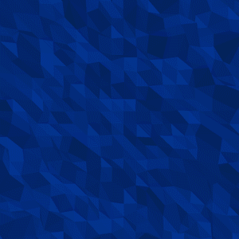
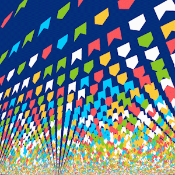
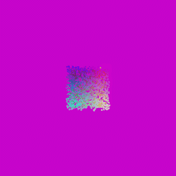

# coffee-with-processing
This is the code repository produced during my live coding sessions on Twitch (check it out on www.twitch.tv/rodjunjun).

Here are the sketches I've done, so far (wait a little bit until the animated GIFs are loaded):

# Low Poly Surfaces
Generates a blue low poly surface (inspired on my profile picture) that reacts to the keyboard input via a separated python script. It's used as the Twitch lives background.

You can check it out on: https://github.com/rodjuncode/coffee-with-processing/tree/master/src/low_poly_surfaces

# Bandeirolas de São João
Generates an infinite stream of small flags, very common on typical brazilian parties (called Festa de São João). The sky above changes its color to simulate the daylight changing over time. I've made this cause this year's Festa de São João didn't happen in Brazil due to COVID-19 pandemics.

You can check it out on: https://github.com/rodjuncode/coffee-with-processing/tree/master/src/bandeirolas_sao_joao

# Color Tripper
A yellow sphere travels through the RGB space. The background reflects the color the sphere is currently visiting. Made to study a solution to the sky color change on the previous project.

You can check it out on: https://github.com/rodjuncode/coffee-with-processing/tree/master/src/color_tripper
